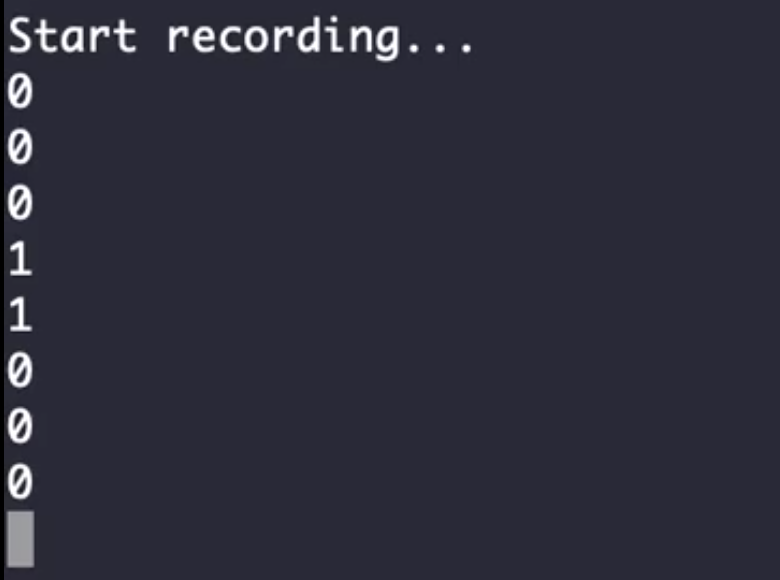

Documentation to be updated. 

# Wake Word Detection

Detect the word "activate" from any audio file with deep RNN.

---

## Demo

  <a href="https://www.youtube.com/watch?v=C0XLqc06p34&feature=youtu.be"><b>Watch the Result (not cherry picked)</b></a>
   
  

---

## Background

---

## Try it Yourself

Requirements in [`info/requirements.txt`](https://github.com/Jacklu0831/Wake-Word-Detection/blob/master/info/requirements.txt)

### Make Your Custom Data

### Train

### Test

---

## Resources

- [pydub](https://github.com/jiaaro/pydub)
- [CS230 slides](http://cs230.stanford.edu/fall2018/slides_week2.pdf)
- [Blog on trigger word recognition](https://www.dlology.com/blog/how-to-do-real-time-trigger-word-detection-with-keras/)
- [Coursera sequence models specialization](https://www.coursera.org/learn/nlp-sequence-models)
